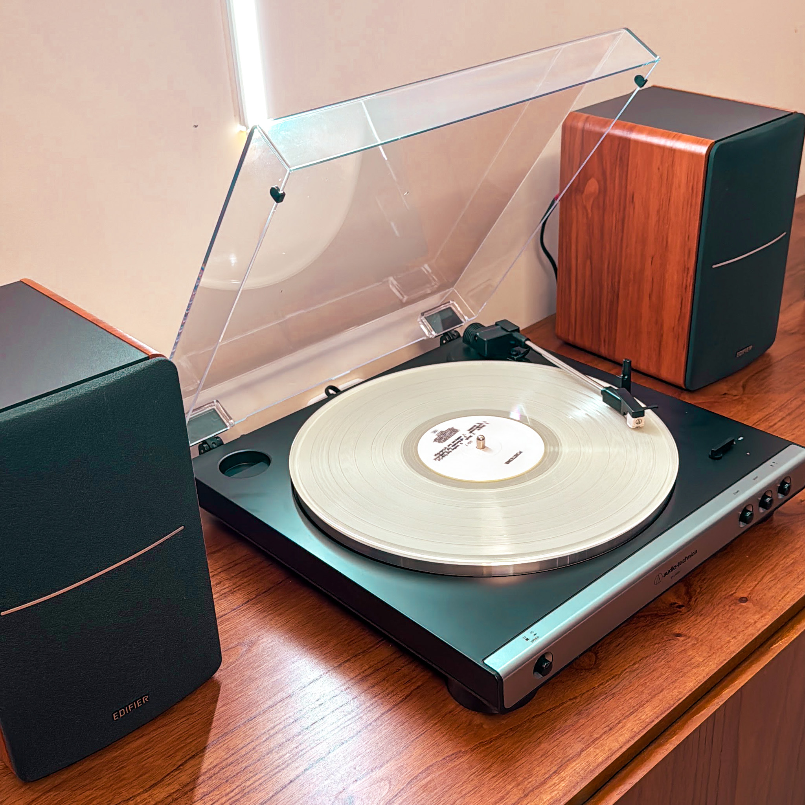
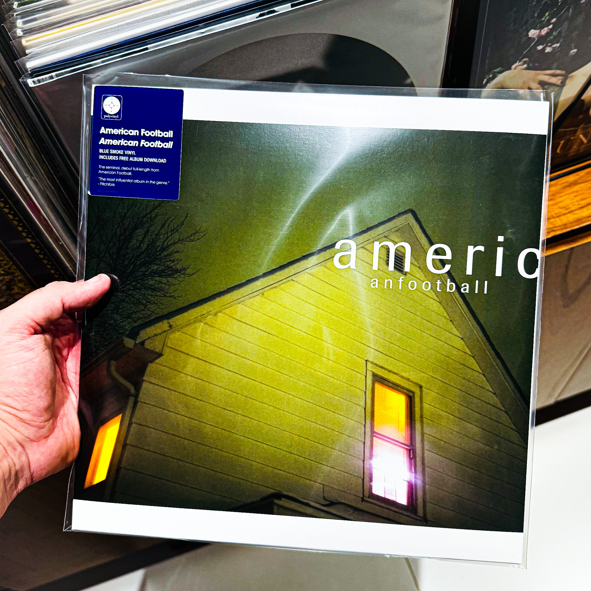
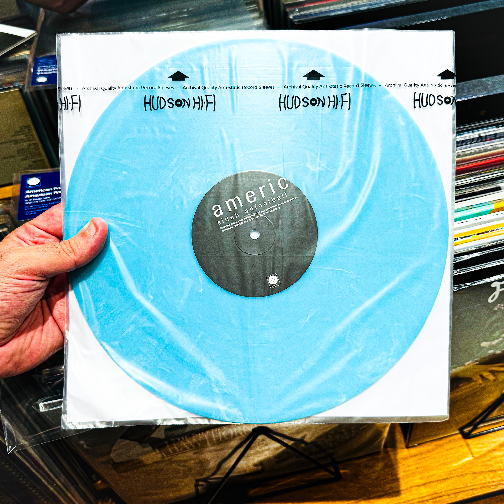
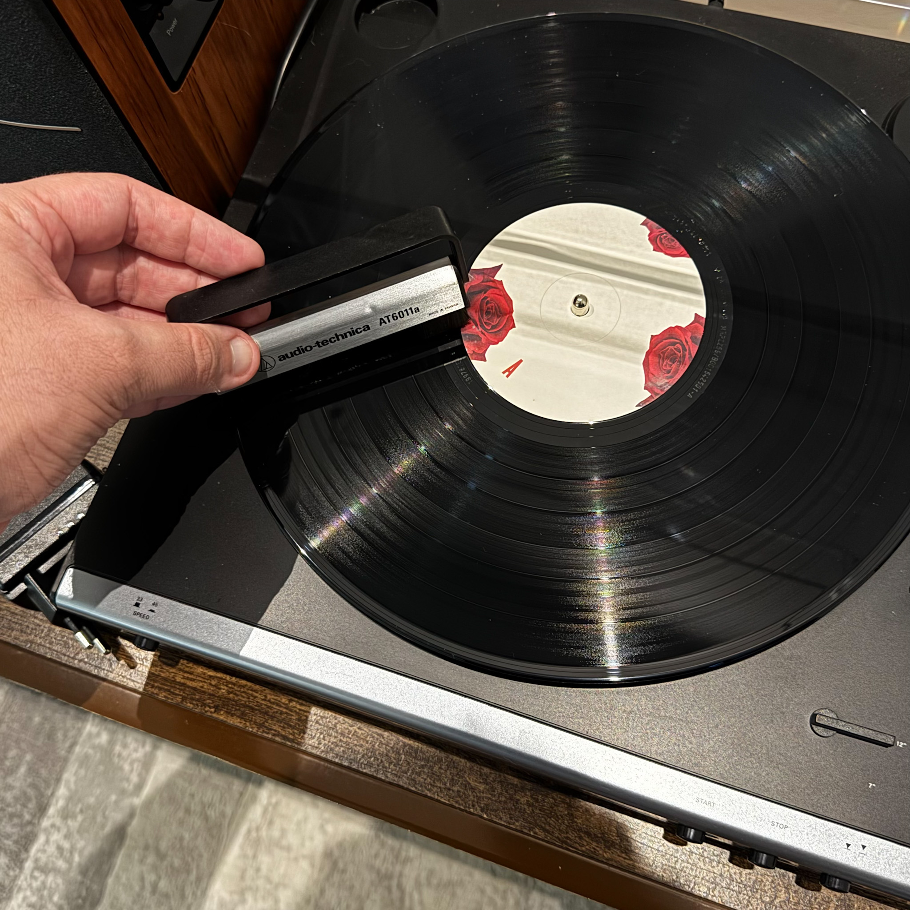

Desde abril do ano passado tenho me engajado em um novo hobby: **colecionar vinil**.

Não houve um motivo específico pelo qual eu decidi começar que não fosse simplesmente o gosto pela música e por toda as formas expandidas de apreciar um álbum. Se tornou quase um ritual onde eu paro um pouco a correria do dia-a-dia e tiro um tempo pra escutar um álbum do começo ao fim, ler as letras e me desconectar um pouco.

Nesse pouco tempo que estou nesse hobby eu aprendi algumas coisas e gostaria de ir compartilhando nesse post. Como (quase) tudo nesse blog, esse post pode ir evoluindo ao longo do tempo e ganhando novas atualizações/melhorias.

Antes de começar, queria pontuar algumas coisas que eu gostaria de ter conhecimento antes de começar, mas que não comprometem o meu ânimo com esse hobby

## O som do vinil é **melhor**?

É importante dizer que a diferença de **qualidade** de uma gravação em vinil para a música em um _streaming_ qualquer é quase imperceptível. Os formatos digitais modernos, especialmente em _lossless_, são muito precisos. A menos que você tenha um ouvido extremamente apurado ou um sistema de som de altíssima qualidade, provavelmente **não notará muita diferença entre uma faixa digital bem masterizada e um disco de vinil**.

Nos primórdios do formato MP3 (anos 90-2000), quando a compressão era pesada pra que se pudesse transferir facilmente uma música, havia alguma ou até grandes perdas de qualidade. Mas isso não é algo que aconteça hoje em dia. Uma matéria mais detalhada sobre isso pode ser encontrada [aqui](https://recordbuilds.com/do-vinyl-records-sound-better/).

Dito isto...

## Quais equipamentos eu preciso?

Os equipamentos farão uma diferença **significativa** na experiência, mas não é necessário gastar tanto pra começar no hobby. Se o que está no seu orçamento é um tocador de vinil junto com um sistema de som simples, tá tudo bem, a experiência de escutar vinil ainda é válida e pode ser muito interessante mesmo assim.

Existem alguns [pontos bem negativos quanto aos aparelhos que parecem uma "maleta"](https://recordhead.biz/why-suit-case-record-players-are-really-that-bad/) e acho que vale a pena analisar isso e talvez investir um pouco mais no começo se você está muito certo que esse é um hobby que lhe agrada.

Eu tive a oportunidade de começar com um equipamento razoável. Tenho um toca-discos [Audio-Technica LP60X](https://amzn.to/4ckaXH1) e um monitor de áudio [Edifier R1280DB](https://amzn.to/4tZQheH). Esse é um setup bem comum na minha visão, vem cumprindo a tarefa até agora e está longe de ser topo de linha.

<figure>
  
  <figcaption>Meu setup. <b>Disco</b>: Ariana Grande - Positions (Glow in the Dark Edition)</figcaption>
</figure>

Não entendo muito sobre os detalhes técnicos de equipamentos de som, mas é algo que tenho lido sobre no último ano e assisto a alguns vídeos do canal [Mind the Headphone](https://www.youtube.com/@MINDTHEHEADPHONE), o conteúdo é muito bom, principalmente pra quem está começando, como tem sido o meu caso.

## Onde comprar discos?

A parte mais empolgante desse hobby pra mim é **comprar discos**, o ato de procurar discos que eu já gosto e, principalmente, descobrir versões especiais dos meus álbuns favoritos é muito divertido e geralmente acaba comigo pesquisando sobre o álbum, lendo sobre seu processo de criação ou descobrindo alguma curiosidade sobre ele.

Pra fins de referência, hoje em dia a maioria dos vinis que eu compro giram em torno de **R$180 a R$250** reais por álbum novo (Abril/2026). Alguns álbuns são mais elaborados, com encartes com letras das músicas ou dedicatória dos artistas e, na minha visão, valem mais a pena. Mas minha sugestão é priorizar os álbuns que você gosta de escutar.

Aqui vão algumas recomendações de onde comprar discos:

### Discos antigos

- **Sebos**. Em muitas cidades é possível encontrar sebos que vendem vinis antigos. Comece a pesquisar no Instagram sobre lojas de discos de vinis que eventualmente algumas perto de você vão aparecer nas recomendações. É comum também ver vendedores de vinis antigos em feiras de antiguidades.
- **Discogs**. O Discogs é um local onde você pode encontrar alguns discos mais antigos a venda. O preço geralmente não é tão atrativo na maioria das vezes (pela minha experiência), mas vale a pena garimpar. Já comprei muitos CDs por lá.

### Discos novos

- **[Amazon](https://amazon.com.br)** geralmente é um bom lugar pra comprar discos novos, principalmente de bandas atuais ou relançamentos. É bem comum encontrar promoções lá e existem alguns grupos especializados em compartilhar promoções na Amazon, como o **[Feirinha](https://feirinha.cc/grupos/)**.
- **[Shopee](https://shopee.com.br) ou [Mercado Livre](https://mercadolivre.com.br)** também tem algumas lojas como a da Universal Music que vendem discos em um preço razoável e as vezes rola umas promoções.

### Clubes de assinatura

Existem alguns clubes de assinatura de vinil onde você paga um preço razoável (Cerca de R$100) para receber periodicamente um vinil novo, mas não há como escolher qual que você vai receber. Nunca assinei nenhum mas indico dois que eu já ouvi boas recomendações:

- **[Noize Record Club](https://www.noizerecordclub.com.br/pages/assine)**. Focado em música brasileira, tem umas edições bem interessantes e pelo que vi sempre acompanha material extra. Comprei de um amigo meu a versão deles do **Cansei de Ser Sexy** (2005), que vem com um livreto sobre a banda.
- **[Clube do Vinil](https://www.clubedovinil.com), da Universal Music**. Aparentemente focado em música brasileira, mas já vi alguns vinis de artistas estrangeiros. Nunca vi uma edição deles pessoalmente.

### Raridades

- **Discogs**. Assim como é possível achar discos antigos por lá, algumas raridades também estão a venda. Na minha experiência, a grande maioria dos discos raros que eu queria eram vendidos por pessoas de outros países, o que implica em imposto na chegada ao Brasil, o que facilmente dobra ou triplica o valor do disco. Alguns vendedores podem te ajudar nisso, fazendo as simulações, mas no geral eu não acho que vale a pena.

## Gerenciando a coleção

Uma boa dica para gerenciar sua coleção é criar uma conta no [Discogs](https://discogs.com). Lá é possível adicionar álbuns que você já tem, organizar em pastas, verificar o preço médio deles e da coleção como um todo. Também é possível criar uma lista de desejos com álbuns que você está procurando, consultar algum disco específico e ver detalhes como capa e outros materiais que estão incluídos.

Se quiser me seguir por lá, meu username é [diogomoreira](https://www.discogs.com/user/diogomoreira).

## Cuidados com o disco

### Plásticos

O plástico externo (_outer sleeve_) para discos de vinil serve para **proteger a capa contra rasgos, amassados e marcas de manuseio**. Pra mim, essa é mais importante de se comprar desde o início, uma vez que a maioria dos discos vem com uma proteção interna, que mesmo que não seja da melhor qualidade já serve pra alguma coisa. O plástico da foto abaixo foi da Hudson Hi-Fi, que comprei em um kit e pode ser encontrado [aqui](https://amzn.to/4enOWtc). Esse tipo de plástico é bem fácil de ser encontrado em valores bem mais baixos em Mercado Livre ou Shopee, não faz tanta diferença na minha visão.

<figure>
  
  <figcaption>Plástico externo. <b>Disco</b>: American Football - American Football</figcaption>
</figure>

O plástico interno para vinil (_inner sleeve_) é usado para proteger o disco de riscos, poeira e estática. Embora a maioria dos álbuns já venha com uma luva de papel para proteger o disco, eu acho que vale a pena investir em uma proteção anti-estática para substituir, pelo ao menos nos seus álbuns preferidos ou que foram um pouco mais caros. O da foto abaixo também é da Hudson Hi-fi e pode ser encontrado pra compra [aqui](https://amzn.to/3Q1FeTu).

<figure>
  
  <figcaption>Plástico interno. <b>Disco</b>: American Football - American Football</figcaption>
</figure>

### Manuseio

Para colocar o disco no tocador, retire o vinil da capa junto com o plástico interno/_inner sleeve_. Encostando o dedo polegar na borda e o indicador no selo (parte central) retire o disco do protetor.

Verifique se há poeira e limpe com uma flanela de microfibra limpa ou utilize uma escova anti-estática como essa da foto abaixo. Você pode encontrar pra comprar [aqui](https://amzn.to/4tiYomm) uma semelhante, mas existem opções bem mais baratas que tem a mesma eficiência.

Para limpar com a escova anti-estática, coloque o disco no tocador e a acione o toca-discos sem deixar que a agulha vá para cima do disco. Segurando a parte metálica da escova, coloque delicadamente o pincel entre os sulcos para fazer voltas até que a poeira seja retirada.

<figure>
  
  <figcaption>Limpando o disco com a escova anti-estática. <b>Disco</b>: Lana Del Rey - Born to Die</figcaption>
</figure>

Na minha experiência que tenho comprado vinis mais novos, limpar no momento de escutar um vinil já é o suficiente uma vez que você mantenha as dicas anteriores de guardar num plástico de proteção e anti estático.

---
